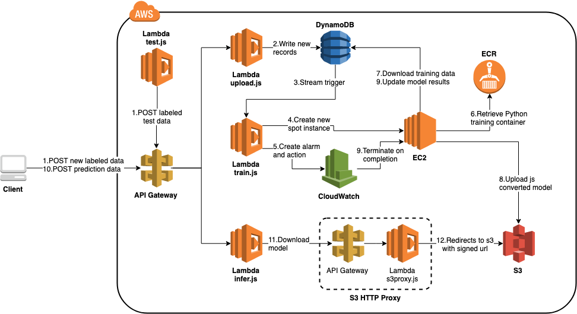

# LambdaAutoTraining

Example Serverless project for creating a full machine learning workflow with AWS Lambda 
and offloading training to EC2.  Uses Node.js for Lambda functions and a 
Python Docker container for training.

View the Medium companion article (link avoids paywall): https://medium.com/@mike.p.moritz/serverless-tensorflow-workflow-with-ec2-auto-training-495f47bd892d?sk=52282f09dc6dbffc9bdac6186850bf7a



## To get started - Node.js Lambda functions
- Install Node.js packages
```
$ cd js && npm init && npm install @tensorflow/tfjs node-fetch
```
- Update `serverless.yml` with your project's properties
- Deploy (assumes you have serverless framework installed)
```
$ serverless deploy --stage <stage>
```

## To get started - Python Docker image for EC2
- Install Python packages (should be inside a virtual environment)
```
$ cd ../py pip install -r requirements.txt
```
- Update Jupyter notebook as needed
- Build Docker image
```
$ docker build -t lambda-auto-training-dev .
```
- Login to ECR if using as Docker repository (assumes AWS CLI installed)
```
$ $(aws ecr get-login --no-include-email --region <region>)
```
- Create repositories if they don't exist
```
$ aws ecr create-repository --repository-name lambda-auto-training/lambda-auto-training-dev
$ aws ecr create-repository --repository-name lambda-auto-training/lambda-auto-training-prod
```
- Tag and push image
```
$ docker tag \
  lambda-auto-training-dev:latest \
  <ecr_id>.dkr.ecr.<region>.amazonaws.com/lambda-auto-training/lambda-auto-training-dev:latest
$ docker push \
  <ecr_id>.dkr.ecr.<region>.amazonaws.com/lambda-auto-training/lambda-auto-training-dev:latest
```
